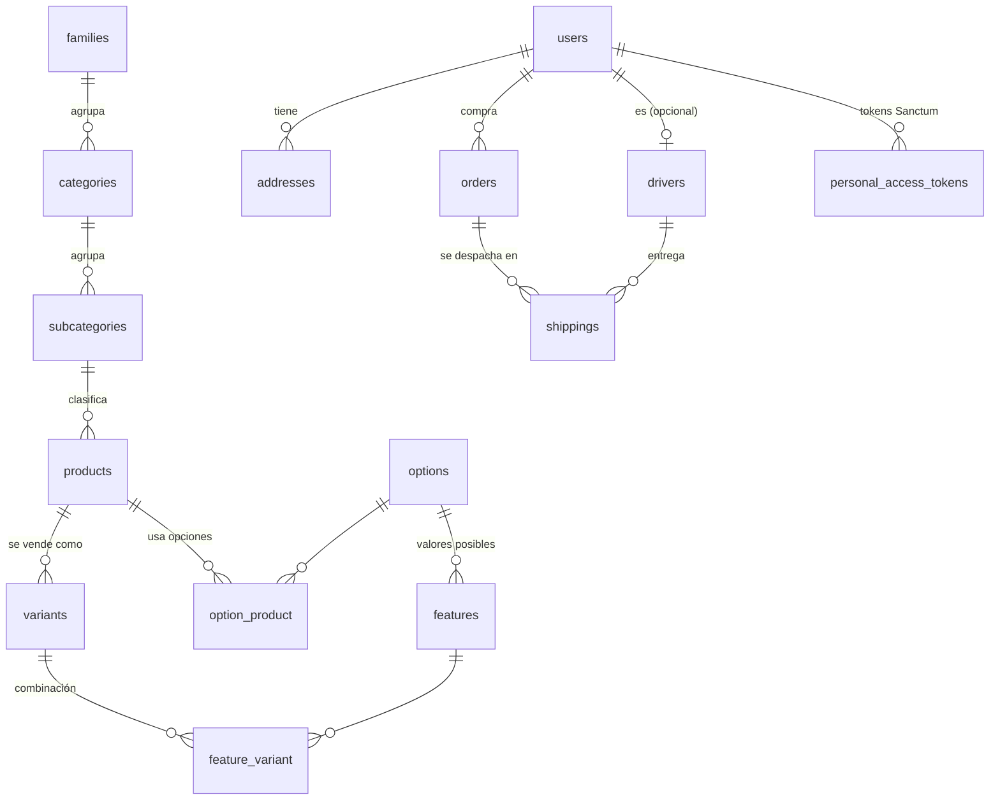

# 3. Modelo de datos

Base de datos: **PostgreSQL**. Todas las tablas listadas existen hoy salvo las marcadas como **(objetivo)**.

## Diagrama general



---

## Por módulo

### Users

**`users`**

| Columna | Tipo | Notas |
|---|---|---|
| id | bigint PK | |
| name, last_name | string | |
| document_type | string | `PP`, `CI`, `RUC` |
| document_number | string | validado por regex según tipo |
| email | string **unique** | |
| phone | string **unique** | |
| password | string nullable | null si entró con Google |
| google_id | string nullable unique | |
| avatar | string nullable | |
| role | enum `ROLE_USER` / `ROLE_ADMIN` | default `ROLE_USER` |

**`covers`**: banners del home (`title`, `image_path`, `is_active`, `order`, `start_at`, `end_at`). `order` lo calcula `CoverObserver`.

Más: `personal_access_tokens` (Sanctum), `sessions`, `password_reset_tokens`.

### Addresses

**`addresses`**: `user_id` FK, `address_line_1/2`, `city`, `province`, `postal_code`, `country` (default `EC`), `reference`, `phone`, `receiver` (int), `receiver_info` (json), `is_default`.

- Usa `BelongsToUser` → cada usuario solo ve las suyas.
- `markAsDefault()` desmarca las otras en transacción.
- Detalle de reglas: [`../addresses.md`](../addresses.md).

### Categories

Jerarquía de 3 niveles, todas con `id`, `name`:

```
families (Tecnología)
└── categories (Celulares)          family_id FK
    └── subcategories (Android)     category_id FK
        └── products                subcategory_id FK
```

- Borrar una **subcategoría** con productos está bloqueado (evento `SubcategoryDeleting` + listener en Products).
- Borrar **familia/categoría** hace cascade hasta los productos ⚠️ (ver [08](08-deuda-tecnica.md)).

### Products: productos, opciones, features y variantes

Es la parte más difícil de entender, así que con un ejemplo: **remera** que viene en Color (Rojo, Azul) y Talle (S, M).

| Tabla | Qué es | Ejemplo |
|---|---|---|
| `products` | Lo que se publica. Tiene `sku` unique, `price`, `stock`, `subcategory_id` | "Remera básica", $20 |
| `options` | Un **eje** de variación (global, reutilizable) | Color, Talle |
| `features` | Un **valor** de una opción (`option_id`, `value`, `description`) | Rojo, Azul, S, M |
| `option_product` | Qué opciones usa el producto **y qué valores habilita** (`features` es **json**) | Remera usa Color [Rojo, Azul] y Talle [S, M] |
| `variants` | Cada **combinación vendible**: `sku`, `stock`, `image_path` | Rojo-S, Rojo-M, Azul-S, Azul-M |
| `feature_variant` | Qué features definen cada variante | Rojo-S = {Rojo, S} |

`VariantService::generateForProduct()` genera las variantes como **producto cartesiano** de los features habilitados. ⚠️ Hoy **borra todas las variantes y las regenera**: si una variante ya se vendió o tiene stock cargado, se pierde (ver [08](08-deuda-tecnica.md)).

Precio: vive en `products.price`. **Las variantes no tienen precio propio.** Si el negocio necesita "talle XL cuesta más", agregar `variants.price` nullable (null = usa el del producto).

Stock: si el producto tiene variantes, manda `variants.stock`; si no, `products.stock`.

### Cart

**`shoppingcart`** (del paquete `gloudemans/shoppingcart`)

| Columna | Notas |
|---|---|
| identifier | id del usuario |
| instance | siempre `shopping` |
| content | colección serializada en base64 |

PK compuesta (`identifier`, `instance`). El invitado **no** tiene fila: su carrito vive en una cookie firmada del front. Ver [06](06-carrito.md).

### Orders

**`orders`**

| Columna | Tipo | Notas |
|---|---|---|
| id | **uuid** PK | no enumerable: nadie adivina `/orders/124` |
| user_id | FK users | scope de ownership |
| status | enum `OrderStatusEnum` | default `pending`, ver [04](04-ordenes-y-estados.md) |
| content | **json** | **foto** de los items al comprar |
| address | **json** | **foto** de la dirección al comprar |
| total | float ⚠️ | debería ser `decimal(12,2)` |
| payment_provider | string | default `niubiz` |
| payment_id | string ⚠️ | **no es unique** hoy (ver [05](05-pagos-e-idempotencia.md)) |
| pdf_path | string nullable | ticket generado por `OrderObserver` |

#### ¿Por qué `content` y `address` son JSON y no FKs?

Porque **una orden es un documento histórico**. Si guardás `address_id` y el usuario edita su dirección mañana, la orden de ayer "se muda". Si guardás `product_id` y cambia el precio, el ticket miente. Amazon, Mercado Libre y cualquier sistema contable hacen lo mismo: **foto inmutable** al momento de la compra.

**Objetivo** cuando haya reportes ("más vendidos", "ventas por categoría"): agregar `order_items` **además** del JSON (o en su lugar):

```
order_items (objetivo)
├── id
├── order_id         FK orders (uuid)
├── product_id       FK products, nullOnDelete  ← para reportes
├── variant_id       FK variants nullable, nullOnDelete
├── name             ← foto
├── sku              ← foto
├── unit_price       decimal(12,2) ← foto
├── quantity
├── features         json ← foto ("Rojo / S")
└── subtotal         decimal(12,2)
```

### Payments (objetivo)

Hoy **no tiene tablas**: el pago solo queda como `orders.payment_id`. Para idempotencia y auditoría hace falta una tabla `payments`, detallada en [05](05-pagos-e-idempotencia.md#tabla-payments).

### Drivers

**`drivers`**: `user_id` FK users, `type` enum (`motorcycle`, `car`), `license_plate`. El conductor **es un usuario** (puede loguearse) con datos extra.

### Shippings

**`shippings`**: `order_id` (uuid FK orders), `driver_id` FK drivers, `status` enum (`pending`, `completed`, `failed`), `delivered_at`, `refunded_at`.

Una orden puede tener **varios** envíos: si una entrega falla, se crea otro.

---

## Convenciones de datos

| Tema | Regla |
|---|---|
| Dinero | `decimal(12,2)` en DB, cast `'decimal:2'`. **Nunca float**: `0.1 + 0.2 != 0.3`. Hoy `products.price` y `orders.total` son float → migrar. |
| PK | `id` bigint. **UUID** para recursos expuestos al cliente que no deben ser enumerables (orders, payments). |
| Slugs | Solo para URLs públicas (SEO). El carrito y las relaciones usan IDs. |
| Snapshots | Todo lo que se "compró" se copia (precio, nombre, dirección). |
| Borrado | `cascade` solo para hijos que no tienen sentido solos (variants de un product). Para históricos (orders, payments) **nunca cascade**: `restrictOnDelete` o soft delete del padre. Hoy `orders.user_id` es cascade: borrar un usuario borra sus órdenes ⚠️. |
| Estados | Columna `enum` + Enum PHP con transiciones. Nunca strings sueltos. |
| Timestamps de hitos | `paid_at`, `shipped_at`, `delivered_at`, `cancelled_at`: responden "cuándo" sin historial. |
| Índices | Toda FK indexada; columnas de filtro frecuente (`status`, `created_at`) indexadas. |
