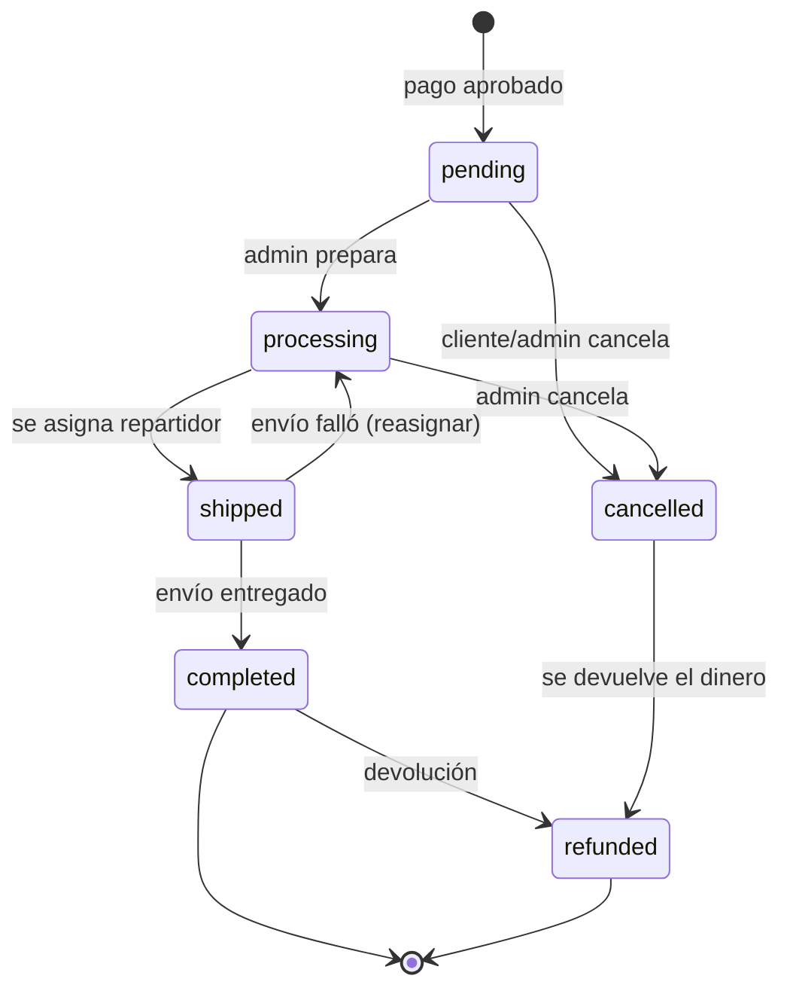

# 4. Órdenes y cambios de estado

> El estado de una orden es **la** cosa que más se rompe en un ecommerce. Órdenes despachadas que nunca se pagaron, canceladas que se entregaron igual, reembolsos dobles. Todo eso pasa cuando cualquiera puede escribir `$order->status = 'x'`.

## Los 3 principios

1. **Un solo punto de entrada:** todo cambio de estado pasa por `Orders\Actions\UpdateOrderStatus`. Nadie más asigna `$order->status`.
2. **Una sola fuente de reglas:** las transiciones válidas viven en `OrderStatusEnum::allowedTransitions()`.
3. **Las transiciones se registran:** quién, cuándo, de qué a qué (objetivo: tabla de historial).

## Hoy

```php
// Orders/Enums/OrderStatusEnum.php
public function allowedTransitions(): array
{
    return match ($this) {
        self::Pending => [self::Processing],
        self::Processing => [self::Shipped],
        default => [],
    };
}
```

```php
// Orders/Actions/UpdateOrderStatus.php
public function handle(Order $order, OrderStatusEnum $next): Order
{
    if (! $order->status->canTransitionTo($next)) {
        throw ValidationException::withMessages([
            'status' => "No se puede pasar de {$order->status->value} a {$next->value}.",
        ]);
    }

    $order->status = $next;
    $order->save();

    return $order;
}
```

Quién la usa:

| Quién | Transición | Cómo |
|---|---|---|
| Admin, botón "Listo para enviar" | pending → processing | `PATCH api/admin/orders/{id}/status` |
| Admin, "Asignar repartidor" | processing → shipped | `POST api/admin/orders/{id}/shipping` → `CreateShipping` → `UpdateOrderStatus` |

**Importante:** hoy la orden se crea **recién cuando Niubiz aprueba el pago**. Entonces `pending` significa *"pagada, esperando preparación"*, no *"esperando pago"*.

---

## Máquina de estados objetivo



```php
public function allowedTransitions(): array
{
    return match ($this) {
        self::Pending    => [self::Processing, self::Cancelled],
        self::Processing => [self::Shipped, self::Cancelled],
        self::Shipped    => [self::Completed, self::Processing],
        self::Completed  => [self::Refunded],
        self::Cancelled  => [self::Refunded],
        default          => [], // refunded, failed: terminales
    };
}
```

`failed` queda para cuando se use el estado "esperando pago" (ver abajo). Mientras la orden se cree después del pago, no se usa.

### ¿Y si quiero crear la orden ANTES del pago?

Es lo que hacen los ecommerce grandes cuando el pago puede tardar (transferencias, pagos en efectivo, 3DS): la orden nace `awaiting_payment` y reserva stock.

```
awaiting_payment ──pago ok──▶ pending (pagada)
        │
        └──pago rechazado / expiró──▶ failed
```

Ventajas: el `purchase_number` de Niubiz es el id de la orden (idempotencia natural, ver [05](05-pagos-e-idempotencia.md)), y podés reservar stock. Costo: un job que expire órdenes impagas. **Para tarjeta sincrónica como hoy, no hace falta todavía.**

---

## Cada transición, su Action con nombre

`UpdateOrderStatus` es la regla genérica. Cuando una transición tiene **efectos propios**, creá una Action con nombre que la use:

| Action | Hace | Efectos |
|---|---|---|
| `CancelOrder` | → cancelled | devuelve stock, dispara reembolso si estaba pagada, `cancelled_at` |
| `CompleteOrder` | → completed | `completed_at`, evento `OrderCompleted` (mail, reseñas) |
| `RefundOrder` | → refunded | llama a Payments para reembolsar, `refunded_at` |

```php
class CancelOrder
{
    public function __construct(private UpdateOrderStatus $updateOrderStatus) {}

    public function handle(Order $order, string $reason): Order
    {
        return DB::transaction(function () use ($order, $reason) {
            $this->updateOrderStatus->handle($order, OrderStatusEnum::Cancelled);
            // devolver stock, guardar motivo...
            OrderCancelled::dispatch($order); // Payments escucha y reembolsa
            return $order;
        });
    }
}
```

Fijate que **Orders no llama a Payments** para reembolsar (Payments está "arriba"). Emite `OrderCancelled` y Payments escucha. Así se respeta la dirección de dependencias.

---

## Historial de estados (objetivo)

```
order_status_histories
├── id
├── order_id      uuid FK orders
├── from          enum nullable (null = creación)
├── to            enum
├── user_id       FK users nullable (quién; null = sistema)
├── note          text nullable (motivo de cancelación, etc.)
└── created_at
```

Se escribe **dentro de** `UpdateOrderStatus`, en la misma transacción. Así es imposible cambiar de estado sin dejar rastro. Sirve para: soporte ("¿quién canceló esto?"), la línea de tiempo que ve el cliente ("Pagado 10:02 → Preparando 11:30 → En camino 15:00") y métricas (tiempo promedio de preparación).

---

## Envíos (Shippings)

El envío tiene **su propia** máquina de estados, independiente de la orden:

```
pending ──entregado──▶ completed   (delivered_at)
   │
   └──────falló──────▶ failed
```

Y **sincroniza** la orden pidiéndole a Orders (nunca tocándola directo):

| Evento del envío | Action de Shippings | Le pide a Orders |
|---|---|---|
| Se asigna conductor | `CreateShipping` | `processing → shipped` |
| Se entrega | `CompleteShipping` (objetivo) | `shipped → completed` |
| Falla la entrega | `FailShipping` (objetivo) | `shipped → processing` (para reasignar) |

---

## Concurrencia: dos admins, mismo botón

Dos admins hacen click en "Asignar repartidor" al mismo tiempo → los dos leen `processing`, los dos pasan la validación, se crean **dos envíos**.

Solución: bloquear la fila al leerla dentro de la transacción:

```php
DB::transaction(function () use ($orderId, $driverId) {
    // Agregar a Order un findForAdminOrFail($id, lock: true) que haga ->lockForUpdate()
    $order = Order::findForAdminOrFail($orderId, lock: true);

    $this->updateOrderStatus->handle($order, OrderStatusEnum::Shipped); // el 2º ve "shipped" → 422
    ...
});
```

El segundo request espera al primero, lee `shipped` y la máquina de estados lo rechaza. Para eso, el `findOrFail` tiene que estar **dentro** de la transacción.

## Tests obligatorios por transición

- Transición válida → 200 y DB actualizada.
- Transición inválida (desde cada estado terminal) → 422 y DB **sin cambios**.
- Si la transición crea otros registros (envío, historial), el 422 no deja registros huérfanos.
- Usuario no admin → 403. Sin token → 401.
