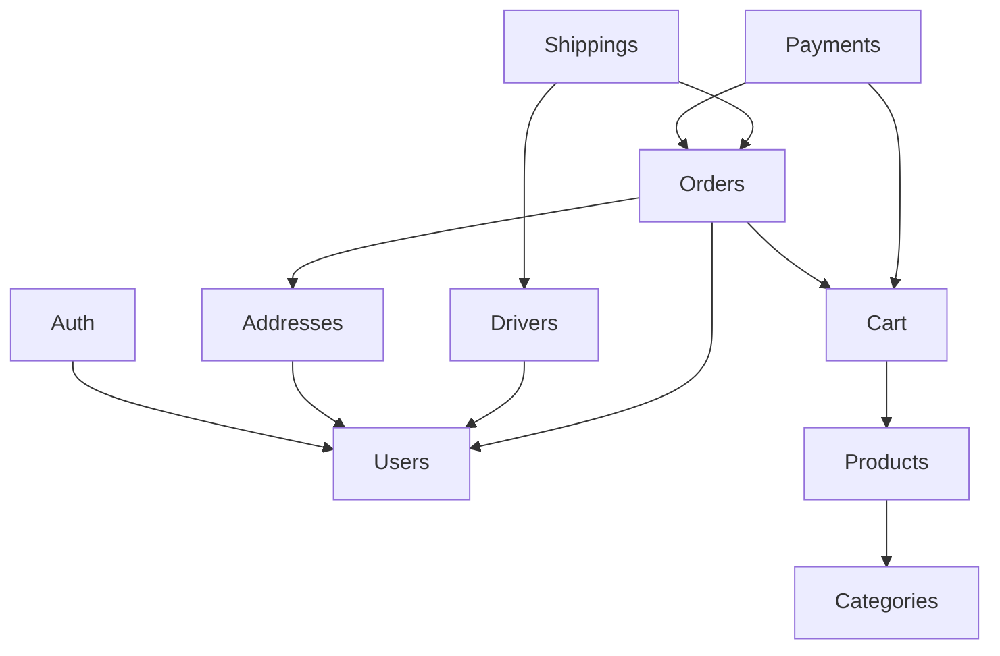

# Arquitectura del backend — Monolito modular en Laravel

Guía de cómo está organizado este backend, **por qué** está organizado así y **cómo hacerlo crecer** sin que se convierta en una bola de barro cuando el ecommerce pase de mediano a complejo.

Cada documento separa dos cosas:

- **Hoy**: cómo está el código ahora (con archivos y tablas reales).
- **Objetivo**: cómo debería quedar cuando el negocio lo pida. No todo hay que hacerlo ya.

## Índice

| # | Documento | De qué trata |
|---|-----------|--------------|
| 1 | [Estructura de un módulo](01-estructura-de-un-modulo.md) | Carpetas, y **cuándo** usar Controller, Request, Resource, Action, Service, Observer, Listener, Policy, Provider |
| 2 | [Comunicación entre módulos](02-comunicacion-entre-modulos.md) | Quién puede conocer a quién, Actions públicas vs eventos, cómo romper ciclos |
| 3 | [Modelo de datos](03-modelo-de-datos.md) | Todas las tablas, relaciones, snapshots, UUID vs ID, productos/variantes |
| 4 | [Órdenes y estados](04-ordenes-y-estados.md) | Máquina de estados, único punto de cambio, envíos, historial |
| 5 | [Pagos e idempotencia](05-pagos-e-idempotencia.md) | Flujo Niubiz, por qué hoy no es idempotente y cómo hacerlo bien |
| 6 | [Carrito](06-carrito.md) | Con tabla vs sin tabla, invitados, merge, precios y stock |
| 7 | [Filtrado y ownership](07-filtrado-y-ownership.md) | Paginación/orden/filtros genéricos, scope por usuario, bypass de admin |
| 8 | [Deuda técnica conocida](08-deuda-tecnica.md) | Bugs y huecos encontrados, priorizados |
| 9 | [Seguridad](09-seguridad.md) | Tokens, tarjetas (PCI), privilegios, rate limit, CORS, logs |

Docs previos que siguen vigentes y se enlazan desde acá:

- [`../cart.md`](../cart.md): implementación detallada del carrito (paquete y alternativa propia).
- [`../addresses.md`](../addresses.md): direcciones estilo Amazon y checklist antes de comprar.
- [`../user-ownership-scope.md`](../user-ownership-scope.md): el global scope por usuario, paso a paso.
- [`../best-practices.md`](../best-practices.md): convenciones de Laravel 12/13, IDs/slugs/UUIDs.

---

## Las 7 reglas de oro

Si te acordás solo de esto, ya estás del lado correcto.

1. **Un módulo = un concepto de negocio con vida propia.** Si tiene su propia tabla, su propio ciclo de vida o su propio actor (cliente, admin, conductor), es candidato a módulo. Si es solo un atributo de otra cosa, es una columna.
2. **Controller = solo HTTP.** Recibe Request validado → llama a una Action → devuelve respuesta. Cero reglas de negocio.
3. **Cada módulo es dueño de su estado.** Si el módulo A necesita cambiar algo de B, **llama a una Action de B**. Nunca `$modeloDeB->campo = x; save()` desde A.
4. **Las dependencias apuntan hacia el núcleo, nunca al revés.** `Shippings → Orders` está bien. `Orders → Shippings` no.
5. **Las reglas viven en UN solo lugar.** Si cambia "cuándo una orden puede despacharse", tenés que tocar un archivo, no tres.
6. **Lo que se compró es una foto, no una referencia.** La orden guarda copia de precios, productos y dirección. Si mañana cambia el precio, la orden vieja no cambia.
7. **No se refactoriza sin tests.** Primero un test que fije el comportamiento actual, después movés lo que quieras.

---

## Mapa de módulos (hoy)

```
app/Modules/
├── Users        núcleo: usuarios, roles, covers del home
├── Auth         login/registro/Google → depende de Users
├── Addresses    direcciones del usuario
├── Categories   Family → Category → Subcategory
├── Products     productos, opciones, features, variantes
├── Cart         carrito persistido por usuario
├── Orders       órdenes, estados, ticket PDF
├── Payments     integración Niubiz, crea la orden al cobrar
├── Drivers      conductores/repartidores
└── Shippings    envíos (orden + conductor)
```

### Dirección de dependencias (objetivo)

Leé la flecha como "conoce a". Los de arriba no saben que existen los de abajo.



Hoy hay dos ciclos que rompen esta regla (`Categories ↔ Products`, `Users ↔ Addresses`). Están explicados con su solución en [02-comunicacion-entre-modulos.md](02-comunicacion-entre-modulos.md#ciclos-actuales-y-cómo-romperlos).

---

## Checklist: crear un módulo nuevo

Ejemplo: `Coupons`.

1. **¿Es realmente un módulo?** Aplicá la regla de oro 1. Un cupón tiene tabla, reglas (vigencia, usos) y lo usa más de un módulo → sí.
2. Crear la carpeta con lo mínimo (ver [01](01-estructura-de-un-modulo.md#estructura-completa)):
   ```
   app/Modules/Coupons/
   ├── CouponsServiceProvider.php
   ├── Actions/
   ├── Http/{Controllers,Requests,Resources}/
   ├── Models/
   ├── Routes/{admin,api}.php
   └── database/migrations/
   ```
3. Registrar el provider en `bootstrap/providers.php`.
4. En el provider: `loadMigrationsFrom`, rutas, observers/listeners **del propio módulo**.
5. Definir **quién depende de quién** antes de escribir código: Coupons conoce a Cart (para aplicar descuento)? o Cart conoce a Coupons? Elegí una dirección y respetala.
6. Tests en `tests/Feature/Coupons/` **antes** de la implementación.
7. Agregar las tablas a [03-modelo-de-datos.md](03-modelo-de-datos.md).

---

## Convenciones del proyecto

| Tema | Convención | Ejemplo |
|------|-----------|---------|
| Actions | Verbo + Sustantivo, sin sufijo, método `handle()` | `CreateShipping::handle()` |
| Parámetro inyectado | Nombre del caso de uso | `CreateShipping $createShipping` |
| Requests | `{Verbo}{Recurso}Request` | `CreateShippingRequest` |
| Resources | `{Recurso}Resource`, `Public{Recurso}Resource` para la tienda | `PublicProductResource` |
| Rutas | `Routes/admin.php` (prefijo `api/admin`, `auth:sanctum` + `can:admin`) y `Routes/api.php` | ver Drivers |
| Carpeta de rutas | `Routes/` con mayúscula (hoy Categories y Users usan `routes/`: unificar) | |
| Tests | `tests/Feature/{Modulo}/{CasoDeUso}Test.php` | `CreateShippingTest` |
| PK | `id` numérico; **UUID** para recursos sensibles expuestos (orders) | ver `best-practices.md` |
| Errores de negocio | `ValidationException::withMessages([campo => msg])` → 422 | `UpdateOrderStatus` |
